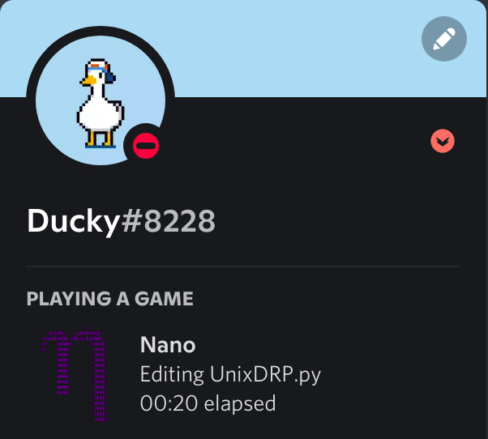

# Terminal-discord-presence
A simple script that detects when the command-line is open, grabs basic terminal info and displays it as Discord Rich Presence

## Requirements
- python3 
`sudo apt install python3` or 
`sudo dnf install python3` etc.

- psutil and pypresence 
`pip install pypresence` & `pip install psutil`

## How to setup Terminal-discord-presence
1. Press the "Code" button and download zip file.

2. Choose the correct `.py` file for your system 
    * [UnixDRP.py] - For GNOME-terminal and KDE-Konsole
    * [WindowsDRP.py] - For Windows CMD, Powershell and Terminal
 
3. Run the file `python3 file_name.py` 

**AND YOU ARE DONE!. ITS THAT SIMPLE**

## Make the python file run on startup
- Copy the python file to /bin: 
`sudo cp -i /path/to/your_main.py /bin`

- Add A New Cron Job: 
`sudo crontab -e`

- Scroll to the bottom and add the following line (after all the #'s): 
`@reboot python /bin/your_main.py &`

- The “&” at the end of the line means the command is run in the background and it won’t stop the system booting up.

- Finally: 
`sudo reboot`

## Nano rich presence!

run the [NanoPresence.py] to show rich presence for the nano CLI editor!  

## Showcase 

GNOME-terminal             |KDE konsole               |Windows
:-------------------------:|:-------------------------: |:-------------------------:
 |  | 
 |  | 
| | | 

<!-- Resources -->

[herelink]: https://discord.com/developers/applications/
[UnixDRP.py]: UnixDRP.py
[WindowsDRP.py]: WindowsDRP.py
[NanoPresence.py]: NanoPresence.py
